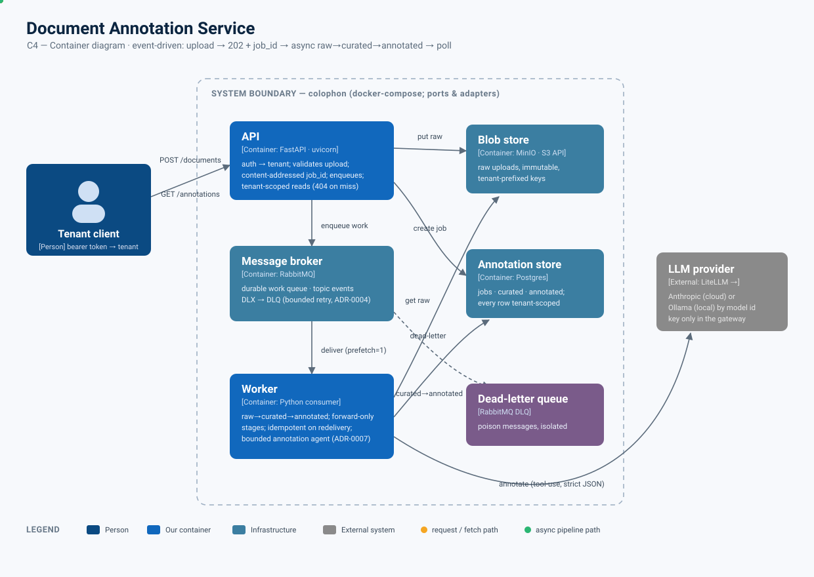
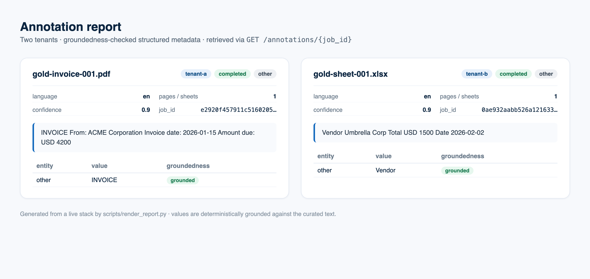
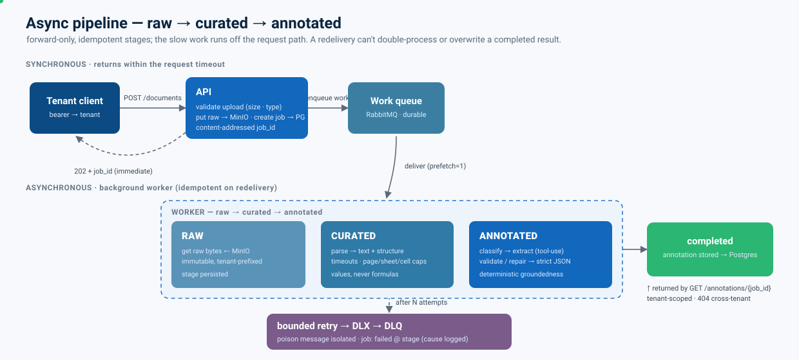

# Colophon — Document Annotation Service

[](https://github.com/leoneperdigao/colophon/actions/workflows/ci.yml)
[](https://www.python.org/downloads/release/python-3120/)
[](https://github.com/astral-sh/ruff)
[](https://mypy-lang.org/)
[](https://github.com/leoneperdigao/colophon/actions/workflows/ci.yml)
[](https://github.com/astral-sh/uv)

Python 3.12 · FastAPI · RabbitMQ · MinIO · Postgres · LiteLLM (Anthropic / Ollama)

An event-driven service that annotates documents with an LLM. `POST /documents`
returns a **job id immediately**; a background worker runs the document through
**raw → curated → annotated** stages and stores a groundedness-checked structured
annotation; `GET /annotations/{job_id}` returns it. Auth, tenancy, idempotency,
retries/dead-lettering and an eval harness are wired through.

> **Context.** This is an 8-hour take-home. The grading rewards *decomposition,
> tradeoffs under time pressure, and how cleanly the pieces fit* — so the rule
> throughout is **design it in, document it, build the minimal honest seam.**
> Restraint is itself a graded signal. Advanced items are designed and documented
> here, with only the load-bearing slice implemented and tested.

<p align="center">
  
</p>

---

## See it run

A live two-tenant run — upload → `202` + job id → background annotation → poll →
**strict-JSON, groundedness-checked result** → and tenant B denied tenant A's job
(`404`, not the record):

<p align="center"></p>

The annotation retrieved via `GET /annotations/{job_id}`, for two tenants:

<p align="center"></p>

> The diagram, demo GIF and report are reproducible: the SVG is committed; the GIF
> (VHS) and PNG (headless Chrome) are regenerated from a live stack with
> [`make media`](scripts/make_media.sh).

---

## Quickstart — clone to running

**Prerequisites:** Docker (or Podman) + Compose. An Anthropic API key or a local
Ollama is optional — the stack ships an **offline `stub` model** so it runs with
no model server.

```bash
git clone https://github.com/leoneperdigao/colophon && cd colophon
cp .env.example .env          # set the per-component secrets; LLM_MODEL=stub works offline
make up                       # docker compose: api + worker + rabbitmq + minio + postgres
```

In another shell, exercise the whole Definition of Done (two tenants, a real PDF
and a real spreadsheet, async processing, tenant isolation):

```bash
make smoke
```

Or by hand:

```bash
# Upload as tenant A -> 202 + job_id immediately (processing continues async)
JOB=$(curl -s -X POST http://localhost:8000/documents \
  -H "Authorization: Bearer tokenA" -F "file=@<some.pdf>" | jq -r .job_id)

# Poll until completed
curl -s http://localhost:8000/annotations/$JOB -H "Authorization: Bearer tokenA" | jq

# Idempotency: identical content re-uploaded by tenant A -> SAME job_id, no reprocess
# Tenant isolation: tenant B fetching A's job -> 404 (not the record)
curl -s -o /dev/null -w "%{http_code}\n" \
  http://localhost:8000/annotations/$JOB -H "Authorization: Bearer tokenB"   # 404
```

To switch from offline to a real model, set in `.env`:
`LLM_MODEL=anthropic/claude-3-5-haiku-latest` + `ANTHROPIC_API_KEY=…`, or
`LLM_MODEL=ollama/llama3.1` + `LLM_API_BASE=http://host.docker.internal:11434`
([ADR-0009](docs/adr/0009-local-llm-via-ollama.md)).

### Make targets

| Target | What it does |
| --- | --- |
| `make up` / `up-d` | Bring the stack up (foreground / detached) |
| `make smoke` | End-to-end check against a running stack |
| `make test` | Unit + integration tests + coverage — **no infra**, runs in seconds |
| `make eval` | Gold-set quality gate (needs a model) |
| `make lint` | `ruff` + `ruff format --check` + `mypy --strict` |
| `make media` | Regenerate the demo GIF + report PNG from a live stack |
| `make down` | Tear the stack down (and volumes) |

---

## How it works

### API contract

| Method | Path | Auth | Returns |
| --- | --- | --- | --- |
| `POST` | `/documents` | `Bearer <token>` | `202` `{ job_id, status: "queued" }` |
| `GET` | `/annotations/{job_id}` | `Bearer <token>` | `200` `{ job_id, status, stage, result, error }` · `404` if not this tenant's |

`POST` validates the upload (size + content-type), stores the raw bytes, creates
the job row, enqueues work, and returns — all well under a request timeout. The
worker does the slow part out of band.

### The async pipeline

<p align="center">
  
</p>

Stages are **forward-only** and each is persisted, and **terminal jobs are
immutable at the store** (a conditional `UPDATE`), so a redelivered message can't
overwrite a finished result and any stage is replayable from the persisted prior
stage. With the deployed **single worker**, that makes redelivery fully safe;
under *concurrent* workers the worst case is benign duplicate processing (same
content-addressed result) — the optimistic-claim hardening is specified in
[ADR-0013](docs/adr/0013-concurrency-and-idempotency-model.md).

### Design decisions (and why)

- **Hexagonal, but only where a second implementation really exists.** Ports are
  defined for exactly five seams — `BlobStore`, `Messaging`, `AnnotationStore`,
  `DocumentParser`, `LLMClient` — because each has a real fake *and* a real
  adapter. The domain and application layers depend only on these ports and are
  **fully testable with no infra running**. No layering for its own sake.
- **Vertical slices, not horizontal layers.** The first slice was end-to-end and
  runnable (upload → 202 → enqueue → stub worker → fetch, with auth + tenant
  threaded), then thickened in place with real parsing, real LLM, real infra.
- **The cloud target is a deploy-time choice, not a rewrite** — ports map
  cleanly to S3 / SQS / DynamoDB or to managed equivalents
  ([ADR-0006](docs/adr/0006-ports-make-cloud-a-deploy-time-choice.md)).
- **One composition root, two profiles.** `APP_PROFILE=memory` wires in-memory
  fakes (CI, the walking skeleton — zero optional imports); `local` wires the
  real adapters, whose infra libraries are imported lazily so the core stays
  import-light. The API (`uvicorn app.asgi:app`) and worker (`python -m
  app.worker`) share the same wiring.
- **Content-addressed identity = idempotency for free.**
  `job_id = SHA-256(tenant_id ‖ 0x00 ‖ filename ‖ 0x00 ‖ content)` (lowercase
  hex, deterministic — not Python's `hash()`). The same upload yields the same id;
  re-processing is a no-op.

### The annotation agent — bounded by design

A **single bounded agent** ([ADR-0007](docs/adr/0007-single-bounded-annotation-agent.md)):
**classify** the document type → **type-specific structured extraction** (LLM
tool-use against a strict JSON schema) → **validate / repair** → **deterministic
groundedness check** (every extracted value must appear in the curated text, or
it's flagged `ungrounded`). No autonomy, no multi-agent orchestration, **no tools
with side effects.** Document content is delimited and labelled as *untrusted
data, not instructions*, and the agent has no ambient authority — so an indirect
prompt injection cannot make it act
([ADR-0005](docs/adr/0005-untrusted-input-and-prompt-injection-defense.md)). One
LiteLLM transport serves both Anthropic (cloud) and Ollama (local), chosen by the
model string.

---

## Production-readiness

The brief asks the README to *reason* about this; the cheap, high-signal parts
are built, the rest is specified.

- **Failure handling (built).** Per-message bounded retry with a dead-letter
  exchange → DLQ; after N attempts a poison message is isolated and the job goes
  to a terminal `failed` state **naming the stage it failed at**, with the error
  captured and the cause logged (never surfaced to clients). Broker-native, not a
  hand-rolled retry loop ([ADR-0004](docs/adr/0004-retry-and-dead-lettering-are-broker-native.md)).
- **Idempotency (built).** Content-addressed `job_id` + forward-only stage writes
  + `ON CONFLICT DO NOTHING/UPDATE` + **terminal-immutable conditional writes**
  make duplicate uploads and redelivery safe (single worker); the concurrent-worker
  TOCTOU and its optimistic-claim hardening are analysed in
  [ADR-0013](docs/adr/0013-concurrency-and-idempotency-model.md).
- **Observability (built + described).** Structured JSON logs correlated by
  `tenant_id`, `job_id`, `stage` on every transition. *Production:* metrics for
  queue depth, per-stage latency, success/failure and **LLM token spend** (LiteLLM
  exposes per-call cost), and tracing across the async boundary (OTel → X-Ray)
  ([ADR-0003](docs/adr/0003-structured-logging-stdlib-now-otel-later.md)).
- **Cost (described).** Cache by content hash (identical docs skip re-annotation —
  already true via the job id); right-size the model (Haiku-tier); cap output
  tokens; LiteLLM budgets / rate-limits cap spend centrally.

---

## Security posture

Tenancy is an **access boundary**, and untrusted input is treated as hostile.
Split into what's wired vs. what's specified for production.

**Built (cheap, high signal):**
- **Secrets never in the repo** — `.env.example` is the only committed env file;
  the real `.env` is gitignored; provider keys live only in the LLM gateway. The
  config layer **fails fast** if a credential env var is missing (no defaulted
  secrets in code).
- **Per-component least privilege** — Postgres, RabbitMQ and MinIO each get their
  own scoped credentials in compose; nothing shared. Containers run **non-root**.
- **Untrusted-input handling** — size + content-type **allowlist** at the edge;
  parsing with **timeouts, page/sheet/cell caps** (defends decompression bombs /
  billion-laughs); spreadsheets are read as **values, never formulas**. The parser
  is routed by the client-declared content-type, but it is **not trusted**: a
  declared-but-mismatched file fails gracefully at the parse stage with a stable,
  user-safe message (the wrong parser raises `ParseError` → job `failed@curated`),
  never a misparse. Magic-byte sniffing is a noted next-step hardening
  ([ADR-0005](docs/adr/0005-untrusted-input-and-prompt-injection-defense.md),
  [ADR-0011](docs/adr/0011-file-size-handling-and-scaling.md)).
- **LLM-injection defense** — document-as-data delimiting, strict structured
  output + validation, and **no tools / no side effects** on the agent.
- **Supply chain** — pinned `uv.lock`; SHA-pinned GitHub Actions; a `pip-audit`
  job in CI.

**Documented (production):** TLS everywhere (API edge, `sslmode=require`, AMQPS,
TLS to the gateway); encryption at rest (S3 SSE-KMS, RDS/EBS, **per-tenant KMS**
as the multi-tenant enhancement); secrets in Secrets Manager / SSM with rotation;
per-Lambda / IRSA execution roles scoped to specific ARNs (no wildcards); egress
allowlists + VPC endpoints; WAF + rate limiting; malware scanning (ClamAV) on
upload. The DLQ and logs are treated as sensitive — they can carry document
content.

---

## Access control & tenancy

Auth and tenancy are **one boundary**: the credential establishes the principal,
the principal carries the tenant, the tenant scopes everything.

- **Authentication (built).** A thin bearer-token dependency maps a token to a
  tenant. The **tenant is derived from the credential, never a client-supplied
  header** — closing the spoofing hole the brief would otherwise invite.
- **Authorization (built).** The operative control is **tenant-scoping**: every
  read/write is filtered by `tenant_id`, enforced at the store. Another tenant's
  job id returns **404, not the record** — covered by a cross-tenant test.
- **Tenancy threading (built).** `tenant_id` flows through the job, storage keys
  (`{tenant}/raw/{job}`), every Postgres row, message metadata, and every log
  line.
- **Pooled now, siloed documented (described,
  [ADR-0008](docs/adr/0008-tenancy-isolation-pooled-now-siloed-documented.md)).**
  Default is pooled (scoped credentials + tenant-scoped rows; optional Postgres
  RLS keyed on `tenant_id` turns isolation into an enforced control). Silo
  (separate DB / account) for governance-heavy clients. AI-layer isolation: the
  shared store / cache / prompt context is tenant-scoped so one tenant's content
  never enters another's prompt.
- **Production IdP path (described).** OIDC / JWT validation against the IdP
  (Cognito / Auth0); API Gateway JWT authorizer or an auth sidecar; short-lived
  tokens, JWKS rotation; RBAC/ABAC if roles emerge. No login flow is built here.

Multi-client customization (per-client config vs. plugin vs. build-time
composition) is analysed in
[ADR-0012](docs/adr/0012-multi-client-customization-and-extension.md).

---

## Evaluation

Quality is measured, not asserted. `make eval` scores a **gold set generated from
known structured records** (so `document_type` and `key_entities` are correct by
construction — free, exact labels) against thresholds:

| Metric | Threshold |
| --- | --- |
| `document_type` accuracy | ≥ 0.90 |
| entity precision / recall | ≥ 0.80 |
| schema-valid rate | = 1.00 |
| **groundedness rate** | ≥ 0.95 |

The eval re-runs the deterministic groundedness check itself rather than trusting
the model's self-report, and entities are scored on `(type, value)` — not value
alone. Low-confidence / ungrounded fields are flagged on the annotation for human
review.

**Groundedness** is normalization-aware containment of each extracted value in the
curated text: it canonicalises numbers (`USD 1,500.00` ≡ `1500`) and folds `/`
date separators (`2026/01/15` ≡ `2026-01-15`), and requires a word/number boundary
for short values (so `IT` doesn't match inside `audit`, nor `1` inside `10`). Known
residual gap, by design: textual-month dates (`January 1, 2024` vs `2024-01-01`)
and locale decimal commas flag ungrounded — the cheap next step is a per-locale
date/number canonicaliser. **Confidence** is a deterministic heuristic, **not**
model-derived: a `0.9` baseline scaled by the grounded fraction of entities — a
proxy that surfaces fabrication, replaced in production by calibrated/logprob
signals.

*Production eval plan (described, [ADR-0010](docs/adr/0010-load-testing-and-robustness.md)):*
an **LLM-as-judge** for open-ended quality, **online** sampling with human
review, and **drift** monitoring on input mix and score distributions. A
real-world, unlabeled robustness corpus (clean / annotated / linked / encrypted /
scanned-image-only / large multi-page PDFs; normal / empty / blank-row
spreadsheets) downloads on demand via `make samples` for ingestion hardening.

---

## Cloud-native migration

The ports make this a swap, not a rewrite
([ADR-0006](docs/adr/0006-ports-make-cloud-a-deploy-time-choice.md)):

| Port / concern | Local | Serverless (AWS) | Kubernetes |
| --- | --- | --- | --- |
| BlobStore | MinIO (S3 API) | S3 | MinIO / S3 |
| AnnotationStore | Postgres | DynamoDB | RDS / Postgres operator |
| Messaging (work) | RabbitMQ + DLQ | SQS + DLQ | RabbitMQ (Amazon MQ / operator) |
| Worker compute | Container | Lambda (container image) via SQS | Deployment + KEDA (scale on queue depth) |
| Inbound HTTP | uvicorn / FastAPI | API Gateway + Lambda (Mangum) | Service + Ingress |
| Auth | Token → tenant map | API Gateway JWT authorizer / Cognito | Auth middleware / sidecar + IdP |
| LLMClient | LiteLLM → Anthropic/Ollama | LiteLLM → Bedrock/Anthropic | LiteLLM gateway |
| Provisioning | docker-compose | AWS CDK (`infra/`) | Helm / manifests |

**Gotchas worth stating up front:** SQS visibility timeout must exceed worker
runtime (else duplicate processing); package the Lambda worker as a **container
image** (PDF + LLM deps blow past the 250 MB layer limit); the Lambda 15-minute
ceiling caps single-doc processing, so very large docs need chunking or a Step
Functions split; on k8s, autoscale workers on **queue depth** (KEDA), not CPU.

---

## Tradeoffs made under time pressure

- **Single in-process worker** runs the stages; the raw/curated/annotated *split*
  is modelled (separate stages, separate persisted results) but not deployed as
  separate services / a Step Functions graph — documented, not built.
- **Pooled tenancy** with scoped credentials + a cross-tenant test; **RLS** and
  per-tenant KMS are specified, not wired.
- **Deterministic gold-set eval** is built; the **LLM-as-judge** and online/drift
  monitoring are designed, not built.
- **LiteLLM SDK**, not a proxy container; **stdlib structured logging**, not OTel;
  CDK / k8s manifests are sketched in the migration table, not shipped.
- The offline **`stub` model** keeps the stack runnable with no model server — a
  deliberate "stay runnable at every slice" choice, swapped for a real provider by
  one env var.

These cuts are the point: a clean, tested, runnable slice plus a README that
commands the full picture.

## What I'd do with another day

- Wire **Postgres RLS** + per-tenant scoped DB roles (turn isolation from
  convention into an enforced control).
- Stand up the **LLM-as-judge** eval and a small online-sampling harness.
- Add **OpenTelemetry** traces across the async boundary and a token-spend metric.
- Ship the **AWS CDK** stack from the migration table and run the worker on Lambda.
- **Agentic evolution path** ([ADR-0007](docs/adr/0007-single-bounded-annotation-agent.md)):
  if the task grows to mixed-modality or open-ended understanding (OCR for scans,
  table extraction, cross-document reasoning), the annotate step becomes a single
  **tool-using agent** (ReAct-style), with an **orchestrator-worker** split only
  if genuinely parallel specialised subtasks emerge. The `LLMClient` port plus the
  staged pipeline make that a swap, not a rewrite — restraint here is the signal,
  not a gap.

---

## Testing

```bash
make test     # unit + integration against fakes + coverage — no infra, seconds
make smoke    # full pipeline on real infra (stack must be up)
make eval     # gold-set thresholds + groundedness (needs a model)
make lint     # ruff + ruff format --check + mypy --strict
```

The domain and application layers are tested with no infra running (TDD,
RED→GREEN→REFACTOR). Infra adapters (MinIO / Postgres / RabbitMQ) have opt-in e2e
tests that **skip cleanly** when the service isn't reachable, so CI stays
infra-free; each was validated against a real container (including
retry → DLQ).

**Coverage.** `pytest --cov` runs by default and CI **fails under 90%**
(currently ~96%). The number scopes the **infra-free, model-free core** — the real
adapters that can only run against external services (MinIO / Postgres / RabbitMQ
blob-store/store/queue, the LiteLLM transport) and the process entrypoints are
omitted from the unit number because they're covered by the opt-in e2e suite and
`make eval`, not the CI run. Omissions are listed explicitly in
[`pyproject.toml`](pyproject.toml) (`[tool.coverage.run] omit`).

---

## Project layout

```
app/
  domain/         # Job state machine, identity (job_id), annotation, entities — pure
  application/    # ports/ (the 5 seams) + services (ingest, process pipeline, get) + groundedness
  adapters/
    inbound/http/ # FastAPI: documents, annotations, auth (bearer -> tenant)
    outbound/     # blob (MinIO), store (Postgres), messaging (RabbitMQ) + in-memory fakes
    parsing/      # pdf, spreadsheet, router, timeout, caps
    llm/          # bounded AnnotationAgent over a LiteLLM transport (+ stub)
  config/         # settings (env, no secrets) + container (composition root, profiles)
  asgi.py · worker/   # the two process entrypoints
eval/             # gold-set scoring + thresholds (make eval)
samples/          # gold-set generator + real-world robustness corpus downloader
scripts/          # smoke, demo, render_report, make_media
docs/adr/         # 13 Architecture Decision Records
specs/            # Spec Kit artifacts (spec, plan, tasks, OpenAPI contract)
```

---

## Architecture Decision Records

Execution-time decisions are recorded in [`docs/adr/`](docs/adr/):

| # | Decision |
| --- | --- |
| [0001](docs/adr/0001-record-architecture-decisions.md) | Record architecture decisions |
| [0002](docs/adr/0002-trunk-based-branching.md) | Trunk-based branching |
| [0003](docs/adr/0003-structured-logging-stdlib-now-otel-later.md) | Structured logging: stdlib now, OpenTelemetry later |
| [0004](docs/adr/0004-retry-and-dead-lettering-are-broker-native.md) | Retry & dead-lettering are broker-native |
| [0005](docs/adr/0005-untrusted-input-and-prompt-injection-defense.md) | Untrusted-input handling & prompt-injection defense |
| [0006](docs/adr/0006-ports-make-cloud-a-deploy-time-choice.md) | Ports make the cloud target a deploy-time choice |
| [0007](docs/adr/0007-single-bounded-annotation-agent.md) | Single bounded annotation agent, not multi-agent |
| [0008](docs/adr/0008-tenancy-isolation-pooled-now-siloed-documented.md) | Tenancy isolation: pooled now, siloed documented |
| [0009](docs/adr/0009-local-llm-via-ollama.md) | Local LLM via Ollama (one LiteLLM transport) |
| [0010](docs/adr/0010-load-testing-and-robustness.md) | Load testing & robustness strategy |
| [0011](docs/adr/0011-file-size-handling-and-scaling.md) | File-size handling & scaling |
| [0012](docs/adr/0012-multi-client-customization-and-extension.md) | Multi-client customization & extension model |
| [0013](docs/adr/0013-concurrency-and-idempotency-model.md) | Concurrency & idempotency model |

## Out of scope (documented, not built)

Postgres RLS · stage events as separate infra (EventBridge / Step Functions) ·
LiteLLM proxy container · CDK / k8s manifests · OpenTelemetry tracing · full
IdP / OAuth · per-tenant KMS & silo deployment · malware scanning / WAF / rate
limiting · LLM-as-judge & online/drift eval. Each is analysed above or in the
linked ADRs — the deterministic gold-set + groundedness checks **are** built; the
judge and monitoring are described.

---

## Colophon

A *colophon* is the note traditionally set at the end of a book recording how it
was made — the printer, the typeface, the date, the place. In other words, a
small block of **structured metadata about a document.** That is exactly what this
service produces for each upload: a summary, a type, key entities, language — a
colophon for every document, generated on demand. Hence the name. (This section
is, fittingly, the README's own.)

**On process (and AI assistance).** The brief permits any tools, so to be
straight about it: this was built with heavy AI-assistant pacing (Claude) under my
direction — I drove the architecture, the tradeoffs, and the reviews; the
assistant accelerated the typing, the docs, the diagrams, and the test scaffolding.
That is why the artifact count (13 ADRs, Spec Kit specs, the C4 + pipeline
diagrams, the demo media) is higher than unaided eight-hour hand-output would be.
The decisions are mine and I can defend each one from first principles; the volume
is leverage, not padding. Restraint was still the rule — the *built* surface is a
deliberately thin, tested, runnable slice, and everything advanced is marked
"documented, not built."
